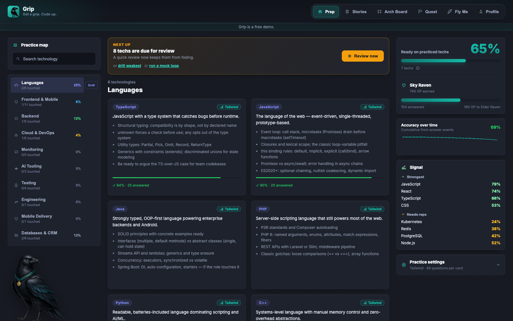
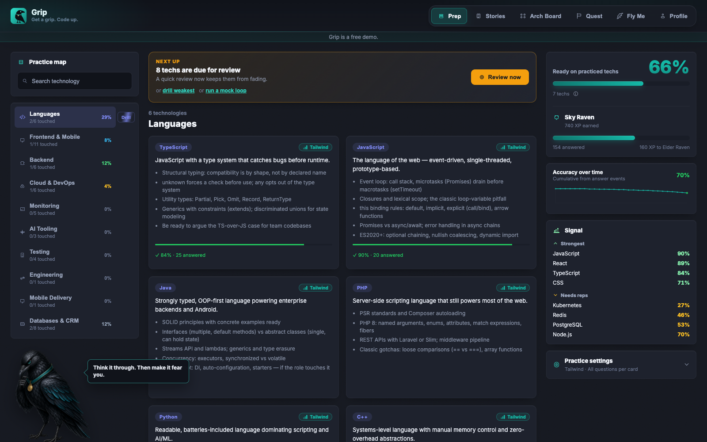
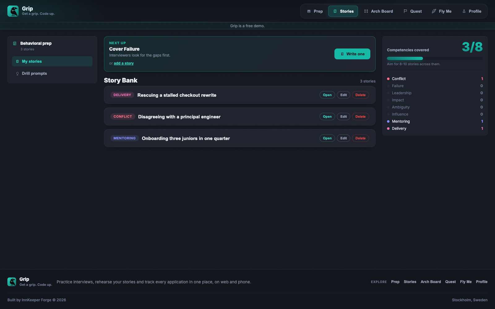
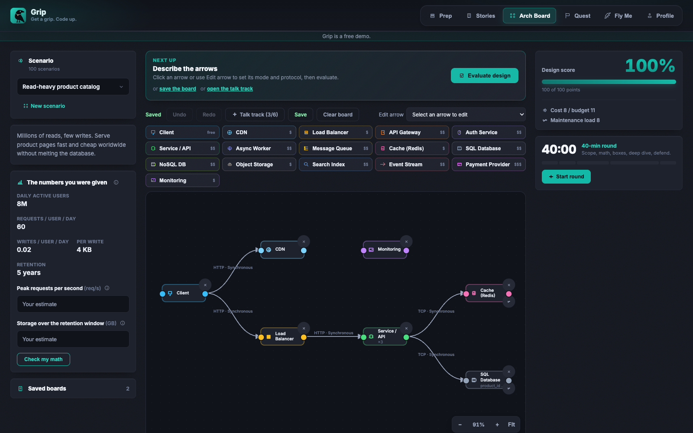
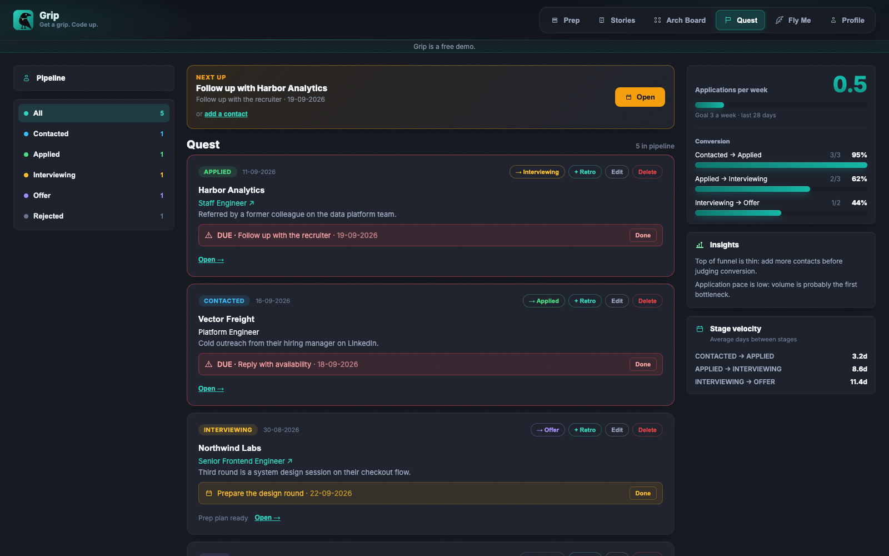
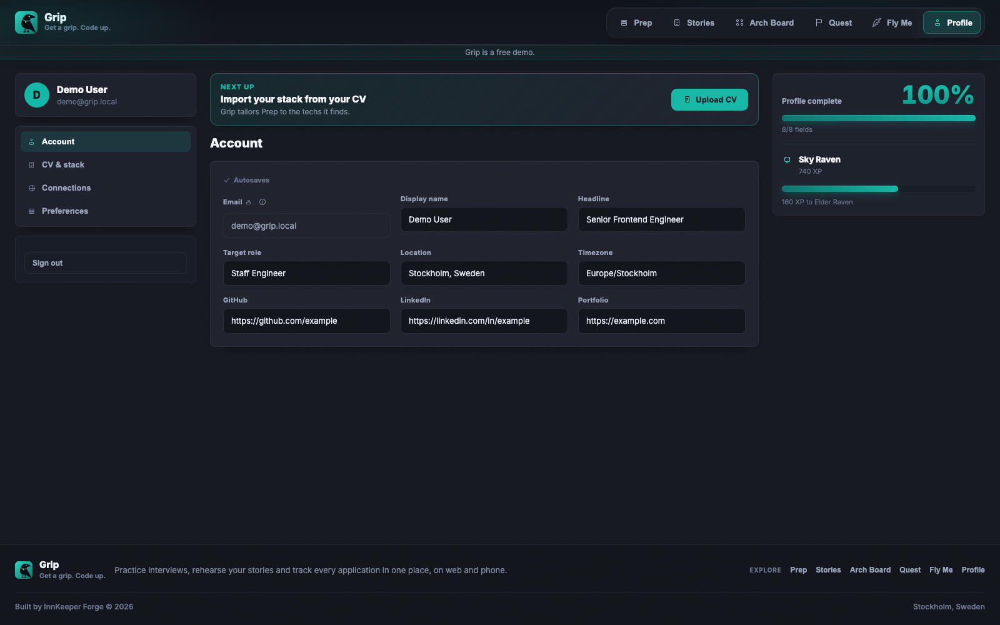

# Grip

Get a grip. Code up.

Interview prep and a hiring-pipeline tracker: a **web app and a React Native mobile app** sharing one Postgres database through Supabase. Built as a study case, where each layer maps to a topic you get asked about in interviews.



## What it does

Six tabs, shared between web and mobile:

| Tab | What you do there |
| --- | --- |
| **Prep** | Quiz cards for 51 technologies, 5,140 questions across four difficulty tiers. Drills target your weakest techs; techs detected from your CV or GitHub get their own category. XP and ranks (Hatchling → Nevermore). |
| **Arch Board** | A full system-design round: draw the boxes, write the six-beat talk track, estimate QPS and storage, then defend it against interviewer follow-ups. 100 scenarios, 16 component types, a 40-minute phased timer. |
| **Stories** | STAR stories across eight competencies, with randomized behavioral prompts. |
| **Quest** | Pipeline tracker (Contacted → Applied → Interviewing → Offer → Rejected) with stage velocity and due follow-ups from the Java pipeline service. |
| **Fly Me** | What the product is and why each piece exists. |
| **Profile** | Private settings, CV import (parsed on-device, only detected techs are saved), score reset. |

Two details worth calling out. **Arch Board scores two halves separately** — topology (the boxes) and reasoning (the talk track) — and readiness stays unassessed until the reasoning is graded, so a pretty diagram alone never reads as a pass. And **estimates are graded by order of magnitude**: within 3× is spot on, within 10× passes.

## Screenshots

Captured at 1600×1000 with `scripts/capture-web-screenshots.mjs`.

| Poe — the raven guide | Stories |
| --- | --- |
|  |  |

| Arch Board | Quest |
| --- | --- |
|  |  |

| Profile |
| --- |
|  |

## Stack

| Layer | Choice | Why |
| --- | --- | --- |
| Backend | Supabase (Postgres, PostgREST, Auth, RLS) | One database, two clients; RLS is the authorization study case |
| Repo | pnpm workspaces | Web and mobile share quiz content and scoring logic |
| Web | Vite + React | Fast dev loop, simple static build |
| Mobile | Expo + expo-router | Tabbed native navigation, Reanimated, Skia canvas |
| Server state | TanStack Query | Caching, dedupe, optimistic updates, offline reads |
| Design | Dark-first, teal accent | One token set drives both apps |

## Layout

```
apps/web/          Vite + React
apps/mobile/       Expo (React Native)
packages/core/     Shared logic: quiz, arch evaluator, scoring, API layer, tokens
  data/questions/  The question bank as reviewable JSON
supabase/          SQL migrations
scripts/           Screenshot capture, question seeding
docs/screenshots/  Product screens used above
```

`packages/core` holds everything both apps need: the quiz and difficulty rules, the Arch Board evaluator and its scenarios, STAR and pipeline logic, the Supabase data layer, and the design tokens. Start with [`api.js`](packages/core/src/api.js) and [`tokens.js`](packages/core/src/tokens.js).

Tables, all with row-level security on `user_id = auth.uid()`: `profiles`, `contacts`, `status_events`, `retros`, `stories`, `answer_events`, `questions`, `saved_boards`, `custom_scenarios`.

## Getting started

Needs Node 22+, pnpm 10.6.5 (via Corepack) and a free Supabase project. Xcode or Android Studio only for the mobile simulators.

```bash
pnpm install
```

Create the two client env files from their examples — [`apps/web/.env.example`](apps/web/.env.example) and [`apps/mobile/.env.example`](apps/mobile/.env.example) — and fill in your Supabase URL and anon key. Vite reads `VITE_*`, Expo reads `EXPO_PUBLIC_*`.

Apply the SQL in `supabase/migrations/` through the dashboard or `supabase db push`. Projects linked before the migrations were renumbered must reconcile their history first: compare against the remote schema before marking anything applied.

Then seed the question bank (optional). Copy [`.env.example`](.env.example) to `.env` at the repo root and add `SUPABASE_URL` plus the service-role key, or export them in your shell:

```bash
pnpm seed:questions
```

The service-role key bypasses RLS. Keep it out of the app env files and out of git.

## Development

Run everything from the repo root.

```bash
pnpm dev                 # web (Vite)
pnpm dev:mobile          # Expo via LAN
pnpm dev:mobile:client   # native dev client (Skia, document picker)
pnpm dev:mobile:ios      # build and run on the iOS simulator
pnpm run ci              # lint, test, typecheck, build
```

Other package scripts are reachable with `pnpm --filter <web|mobile> <script>`.

To refresh the screenshots above, start the web server and run the capture script against it:

```bash
pnpm --filter web dev --port 5174
node scripts/capture-web-screenshots.mjs http://localhost:5174/
```

It injects a local-only browser session for the captures; it creates no Supabase account and writes no app data.

## Testing

307 tests: 274 in core (Jest), 23 on web (node:test), 10 on mobile (React Native Testing Library), plus Maestro smoke flows.

```bash
pnpm test                                     # all three packages
pnpm --filter @grip/core test                 # quiz, arch evaluator, dates, analytics, API
pnpm exec maestro test apps/mobile/.maestro/smoke.yaml --appId <expo-app-id>
```

Core tests also guard the question bank: prompts must be unique per tech across levels, and a question's four options must all differ.

CI is one required GitHub Actions gate, `CI / Run checks`, running the same four steps as `pnpm run ci` with read-only permissions and a 15-minute timeout.

## Deployment

`pnpm build` outputs `apps/web/dist/` for any static host. The app routes client-side, so the host must serve `index.html` for every path — [`apps/web/vercel.json`](apps/web/vercel.json) does this on Vercel with root directory `apps/web`.

Mobile builds go through `pnpm exec eas build` (`.ipa` / `.aab`). Expo OTA updates are parked on purpose: the app ships pinned SDK versions for predictability.

## Study case: what each piece teaches

| Topic | Where | Why it matters |
| --- | --- | --- |
| Postgres + RLS | `supabase/migrations/` | Authorization at the database edge |
| PostgREST | `packages/core/src/api.js` | The schema is the API contract |
| TanStack Query | `apps/*/src/` | Server state: caching, dedupe, offline |
| Reanimated + Skia | `apps/mobile/src/components/` | JSI and GPU rendering at 60fps |
| System design | `packages/core/src/arch.js` | Cost against reliability against complexity |

## Contributing

Put logic in `packages/core` with tests beside it in `__tests__/`, consume it from each app separately, update tokens if colors or spacing change, and run `pnpm run ci` before committing.

Further reading: [DESIGN.md](DESIGN.md) for tokens and visual rules, [SCREEN-GUIDELINES.md](SCREEN-GUIDELINES.md) for screen structure, [BRAND.md](BRAND.md) for naming and mascot use, [PLAN.md](PLAN.md) for phases and decisions, and [CHANGELOG.md](CHANGELOG.md) for what changed when.

## License

MIT. Personal project, open sourced for learning.

---

**Last updated:** September 20, 2026 · **Status:** Phase 5 (polish and delivery; EAS/OTA parked). Pipeline analytics live, CV import shipped on both clients, question bank at 5,140 questions.
